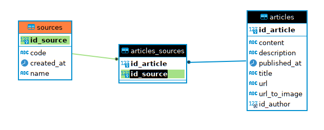
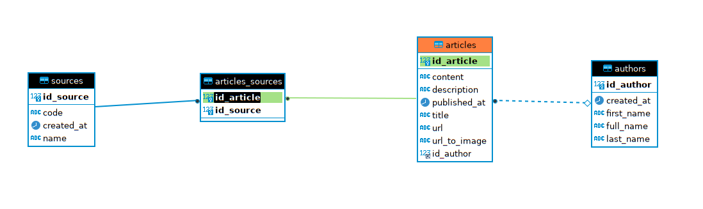
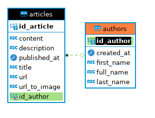
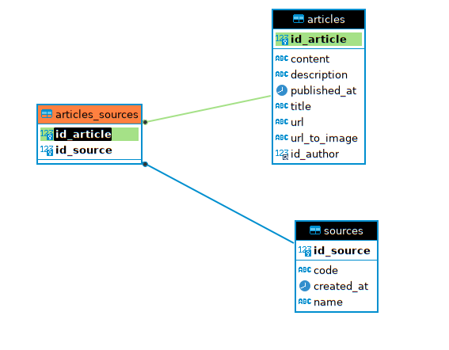
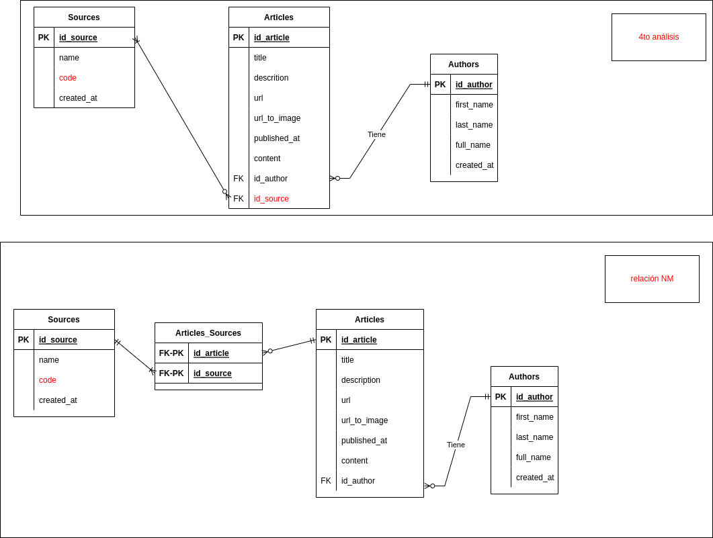

# aas-v0.1
## Article Author Source

## DESCRIPCIÓN DE LA APLICACIÓN (API)
Aplicación donde se publicaran varios articulos de noticias.
Los articulos
- pueden pertenecer a diferentes fuentes (periodicos, blogs,etc) y
- la autoria de cada uno es por un autor (solo uno).
Los articulos que proveera la API por defecto son solo los publicados.

### De las siguientes entidades se necesita conocer y registrar

#### ARTICLE:
- id (autogenerado)
- title: Representa el titulo
- description: Breve descripcion de la noticia
- url: Link hacia la pagina de la noticia  ej: https://www.infobae.com/america/ciencia-america/2022/07/12/en-vivo-la-nasa
- urlToImage: Link de la imagen de portada ej: https://www.infobae.com/new-resizer/4q_cPUh59XY.jpg
- publishedAt: Fecha de publicacion
- content: Texto completo del contenido de la noticia
- Author: Relacion con Author
- Source: Relacion con Fuente de la noticia

#### Source:
- id (autogenerado)
- name: Nombre de la Fuente (ejemplo: Infobae)
- code: Representa el nombre con un patron (ej: Si el nombre es: La Nacion, el code sera la-nacion) de solo minusculas y los espacios en blanco se reemplazan con el simbolo -
- contenido (cuerpo de la publicación)
- createdAt: Fecha de creacion

#### Author:
- id (autogenerado)
- firstname: Primer Nombre
- lastname: Apellido
- fullname: Nombre completo (firstname + apellido)
- createdAt: Fecha de creacion

### OPERACIONES CON LA API

#### Author
1. ALTA, BAJA Y MODIFICACIÓN
2. CONSULTA (OBTENER TODOS LOS Autores)
3. CONSULTA (OBTENER TODOS LOS USUARIOS QUE CONTENGAN UN STRING BUSCADO EN EL FULLNAME)
   - LA PALABRA PUEDE COINCIDIR EN CUALQUIER PARTE DEL FULLNAME.
4. CONSULTA (OBTENER TODOS LOS AUTORES QUE FUERON CREADOS LUEGO DE UNA FECHA DADA)

#### Source
 1. ALTA, BAJA Y MODIFICACIÓN DE FUENTES (SOURCES)
 2. CONSULTA - OBTENER TODOS LOS SOURCES
 3. CONSULTA - OBTENER TODOS LOS SOURCES QUE CONTENGA UNA PALABRA DADA
    - LA PALABRA PUEDE COINCIDIR EN CUALQUIER PARTE DEL NOMBRE

#### Article
1. ALTA, BAJA Y MODIFICACIÓN DE ARTICULOS (ARTICLES)
2. CONSULTA - OBTENER TODOS ARTICULOS (SEGUN UNA PALABRA BUSCADA).
3. PUNTOS EXTRA: SI SE APLICA PAGINACION A LOS RESULTADOS.

    ##### Observaciones
   - La palabra a buscar debe ser mayor a 3 caracteres
     - Solo los articulos publicados se deben retornar
     - LA QUERY DEBE BUSCAR SOBRE LOS CAMPOS (title, description)
     - Opcional: La query anterior debe abarcar tambien content y el fullname del author

### OBSERVACIONES - TIPS
  1. PUEDEN HABER MÁS ENTIDADES QUE NO ESTÁN MENCIONADAS EXPLÍCITAMENTE. PUEDEN AGREGAR MÁS SI CREEN NECESARIO.
  2. CADA VERSIÓN DE LA API QUE DESARROLLEN (PORQUE AGREGARON UNA NUEVA FUNCIONALIDAD) Y ES TESTEADA (PASA LAS PRUEBAS)
     - **SE DEBE SUBIR A GITHUB.**
     - DE ESA FORMA PODRÁN VOLVER A UNA VERSIÓN ANTERIOR SI AGREGAN MUCHOS CAMBIOS Y LA API QUEDA INESTABLE.
  3. EL ESCENARIO SE PUEDE REFINAR. PROPONIENDO CASOS DE PRUEBAS Y MEJORAS.
  4. DEBE TENER AL MENOS 2 TEST UNITARIOS

### CRITERIOS A EVALUAR
1. PRESENTACION (CODIGO SUBIDO A GITHUB)
2. SE EVALUARÁ LA FUNCIONALIDAD DE ACUERDO A LAS OPERACIONES QUE SE SOLICITARON Y NO TANTO DETALLE EN EL ESTILO Y PERFORMANCE DEL CÓDIGO (SI USASTE UNA TÉCNICA RÁPIDA O LENTA).
3. ACOMPAÑADO CON EL CÓDIGO DEBERÁ IR EL ARCHIVO CON LA
4. COLECCIÓN DE POSTMAN DE LA API A EVALUAR (SE LO SUBE EN LA RAÍZ DEL PROYECTO).
5. SE PODRA PRESENTAR EL TRABAJO EN GRUPO (MAXIMO 2 PERSONAS)

### EVALUACIÓN - FORMATO DEMO
1. DEBEN TENER PREPARADO - CORRIENDO Y CONFIGURADO
2. SE ACORDARÁ UN HORARIO. Y TENDRÁN 15-20 MINS PARA EXPONER.
3. ES INDIVIDUAL, PERO PUEDEN TRABAJAR EN EQUIPO.
4. PUEDE HABER ERRORES Y CORRECCIONES. DEBERÁN REPROGRAMAR
LA DEMO.
